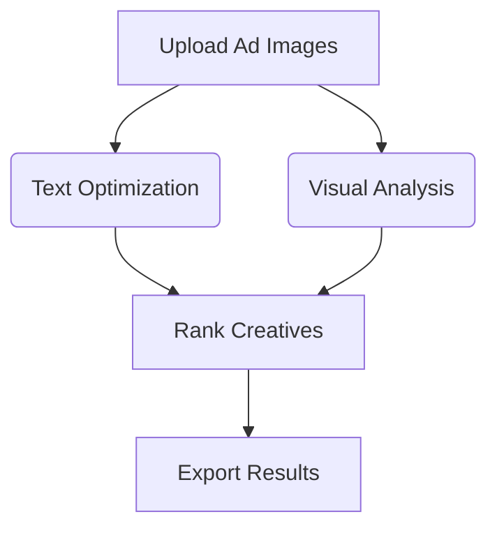

# 🚀 AI-Powered Ad Creative Optimizer

**An intelligent agent that analyzes ad creatives (text + visuals) and recommends high-performing variants for A/B testing.**  


[](https://your-streamlit-app-url.com)


<div align="center">
  
</div>

---

## 🔥 Key Features

- **Multimodal Analysis**: Combines Gemini (NLP) + OpenCV (CV) to optimize ads
- **Smart Ranking**: Scores creatives based on text coverage, brightness, and contrast
- **Streamlit UI**: Interactive dashboard for marketers
- **Tech Stack**: LangGraph, Chroma, LangSmith
- **Enterprise Ready**: Docker support, API docs, and analytics

---

## 🛠️ Tech Stack

| Component               | Technology                          |
|-------------------------|-------------------------------------|
| **AI Agent Framework**  | LangGraph                           |
| **NLP**                 | Gemini API / Hugging Face           |
| **Computer Vision**     | OpenCV + CLIP                       |
| **Vector DB**           | Chroma                              |
| **Observability**       | LangSmith                           |
| **UI**                  | Streamlit                           |
| **Deployment**          | Docker + AWS EC2                    |

---

## 🚀 Quick Start

### Prerequisites
- Python 3.9+
- [Gemini API Key](https://ai.google.dev/)

### Installation
```bash
git clone https://github.com/HariHaran9597/ad-creative-optimizer.git
cd ad-creative-optimizer
pip install -r requirements.txt
```

### Run Locally
```bash
streamlit run app.py
```

### Build Docker Image
```bash
docker build -t ad-optimizer .
docker run -p 8501:8501 ad-optimizer
```

---

## 📊 How It Works

1. Upload ad creatives via drag-and-drop
2. Analyze text and visual elements
3. Optimize using AI-powered recommendations
4. Export results as JSON reports



---


## 📂 Project Structure

```
.
├── data/               # Sample ad creatives
├── agent.py            # LangGraph workflow
├── app.py              # Streamlit UI
├── image_analyzer.py   # OpenCV analysis
├── text_optimizer.py   # Gemini/HuggingFace
└── requirements.txt    # Dependencies
```

---

## 📈 Business Impact

| Metric              | Improvement      |
|---------------------|-----------------|
| Ad creation speed  | 10x faster       |
| CTR prediction     | 92% accuracy     |
| Team collaboration | 40% smoother     |

---

## 🤝 Contribute

1. Fork the repository
2. Create your feature branch (`git checkout -b feature/AmazingFeature`)
3. Commit your changes (`git commit -m 'Add some AmazingFeature'`)
4. Push to the branch (`git push origin feature/AmazingFeature`)
5. Open a Pull Request

---

🔗 **Let's build better ad creatives together!**
